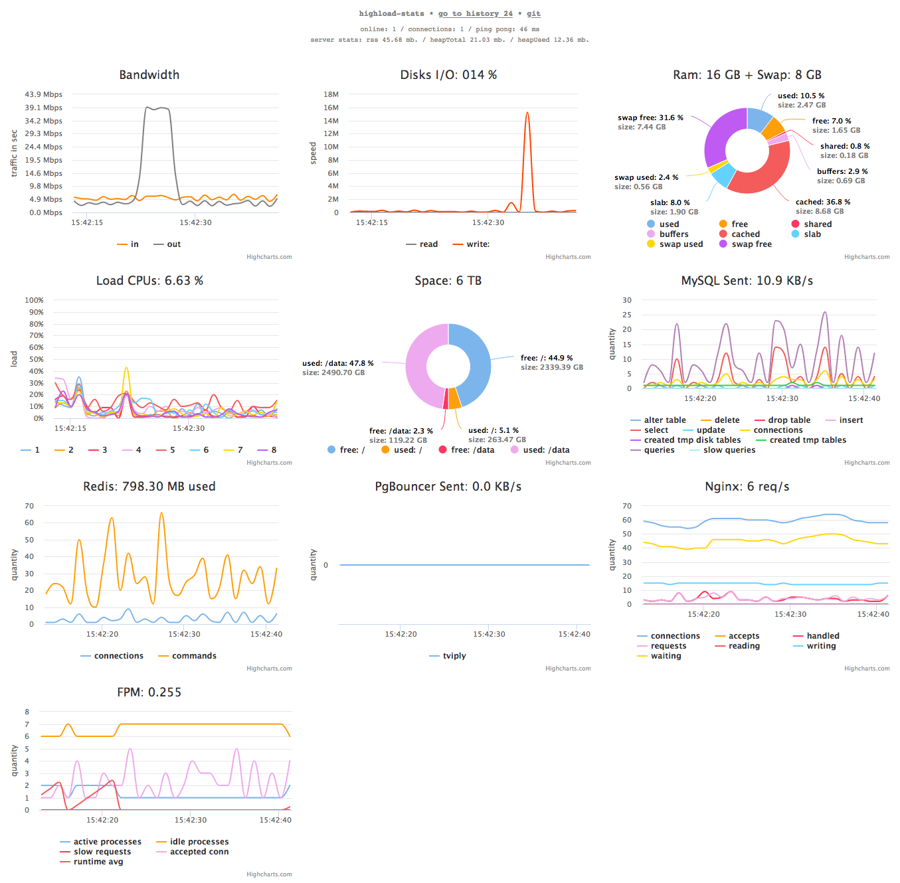

# highload-stats
Statistics server in real-time graphs.


## Install for Debian/Ubuntu/...
Execute in console
```bash
# Get code
cd ~ && git clone https://github.com/oxmix/highload-stats.git

# Install nodejs and sysutils
curl -sL https://deb.nodesource.com/setup_9.x | sudo -E bash -
sudo apt-get update && sudo apt-get install -y nodejs ifstat iotop redis-tools postgresql-client

# Install server
cd ~/highload-stats/server && npm i
chmod +x restart.sh server.js

# PS: If need telemetry stats disks
sudo apt install smartmontools
```

## Run 
* in console # `cd ./server/ && ./restart.sh`
* open in browser `http://remote.host.io:3939`

## If need only through access by key
* create file .access-key in folder ./server, console # `</dev/urandom | fold -w 32 | head -n 1 | sha256sum | awk '{print $1}' > ./server/.access_key`
* now restart, console # `./restart.sh`
* open in browser `http://remote.host.io:3939/e3b0c44...852b855`

## Debug 
* back-end - run console `sudo ./server/server.js debug` or only `info|warn|error|msg`
* frond-end - `./web/external/common.js` => `debug: true`

## Proxy 
Example for proxy nginx >= 1.3.13
```
server {
    location /highload-stats/ {
        proxy_pass http://remote.host.io:3939;
        proxy_http_version 1.1;
        proxy_set_header Upgrade $http_upgrade;
        proxy_set_header Connection "upgrade";
    }
}
```